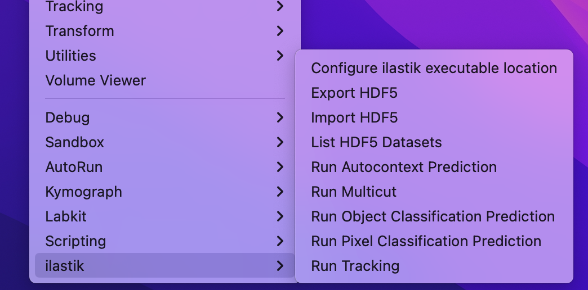
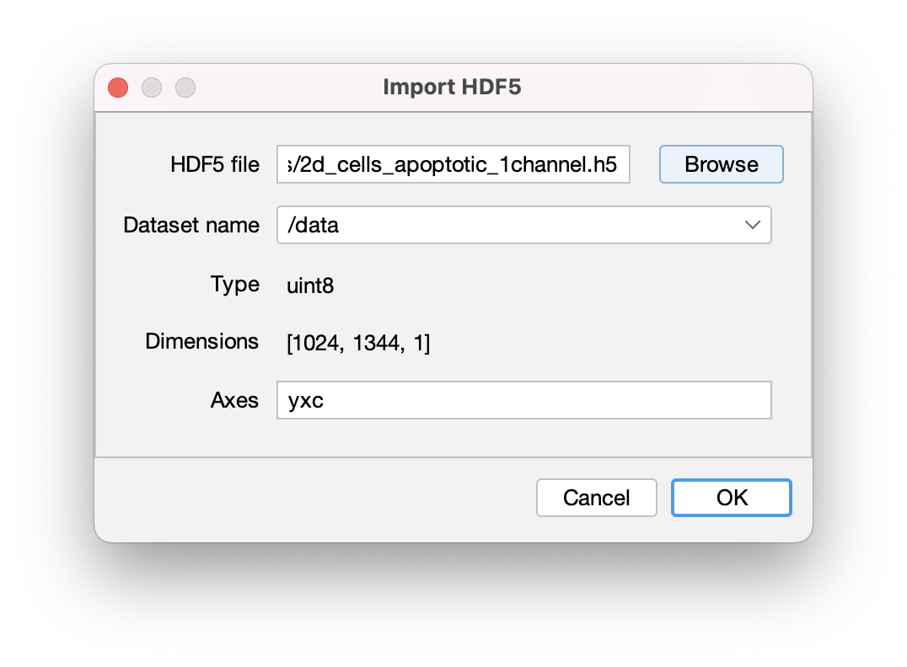
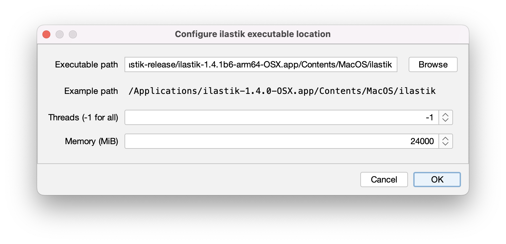
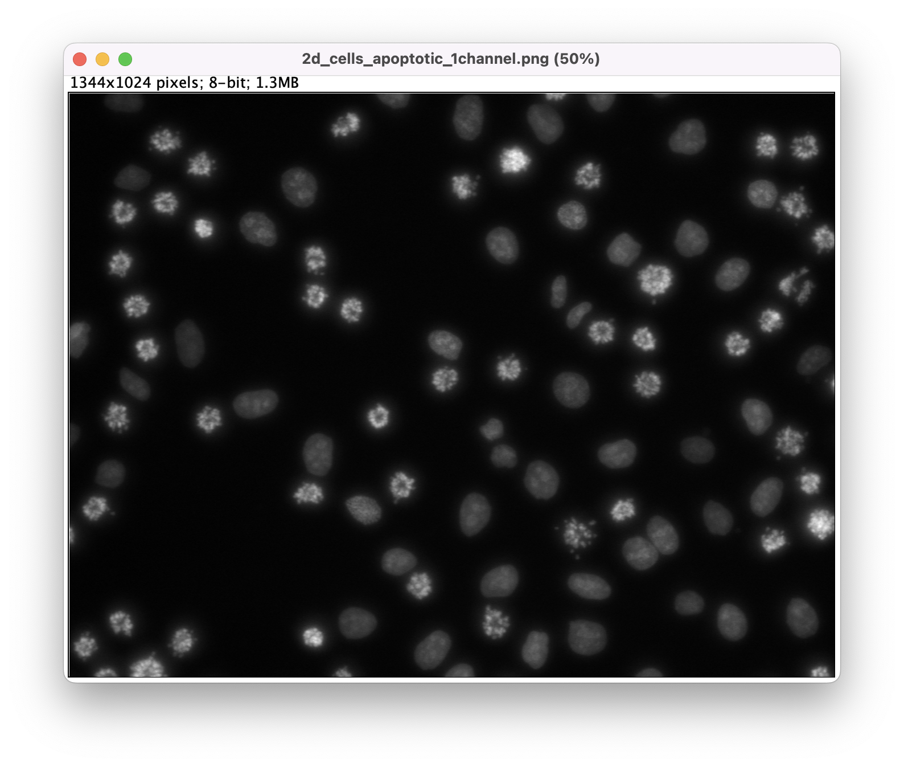
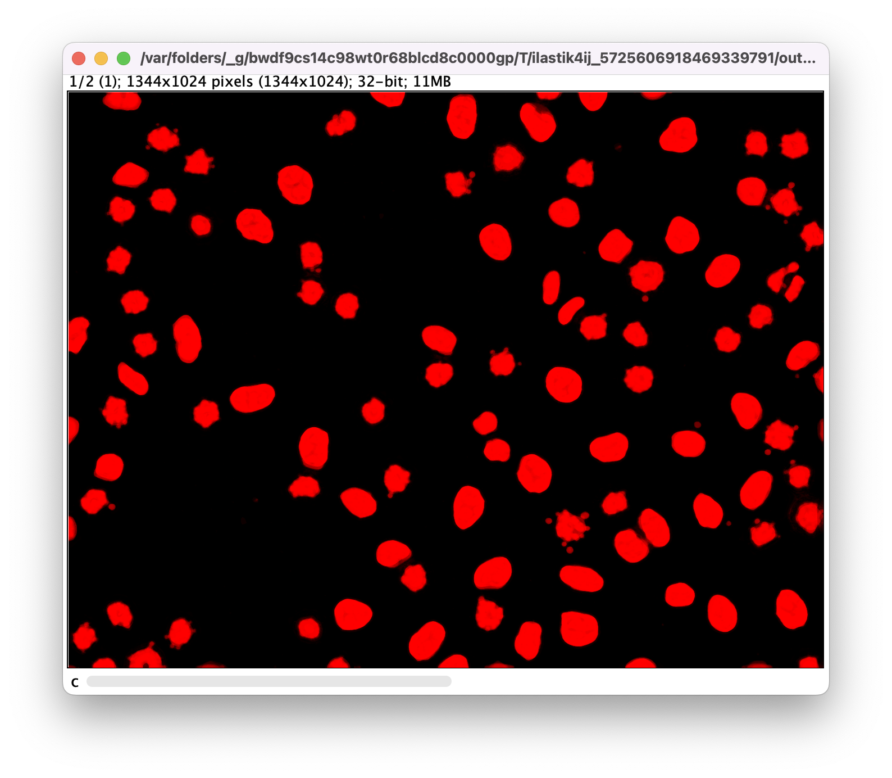
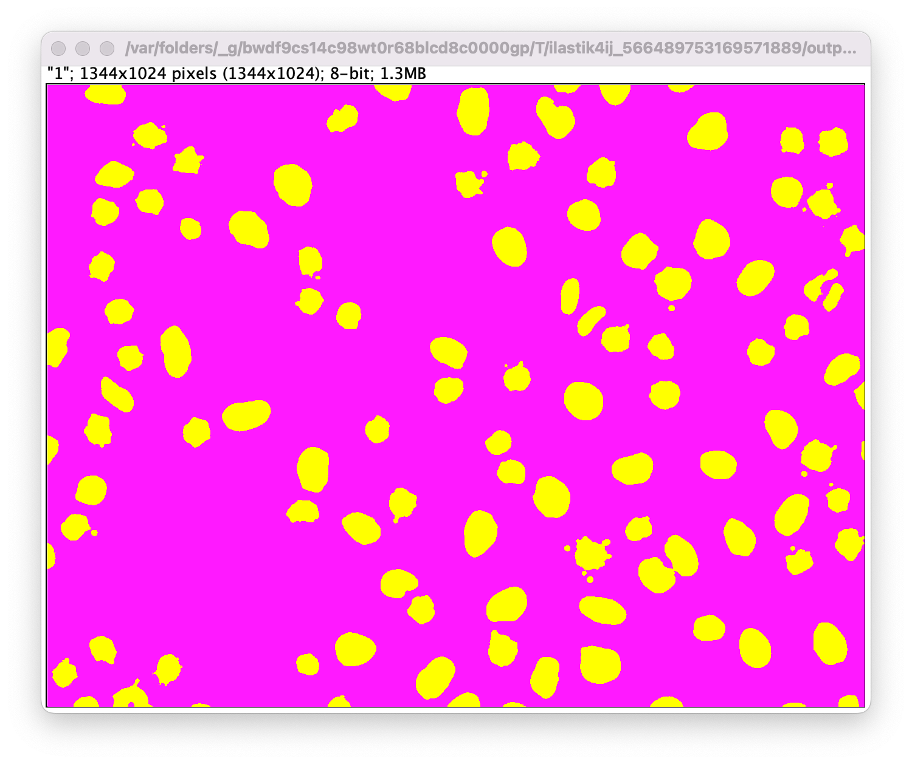
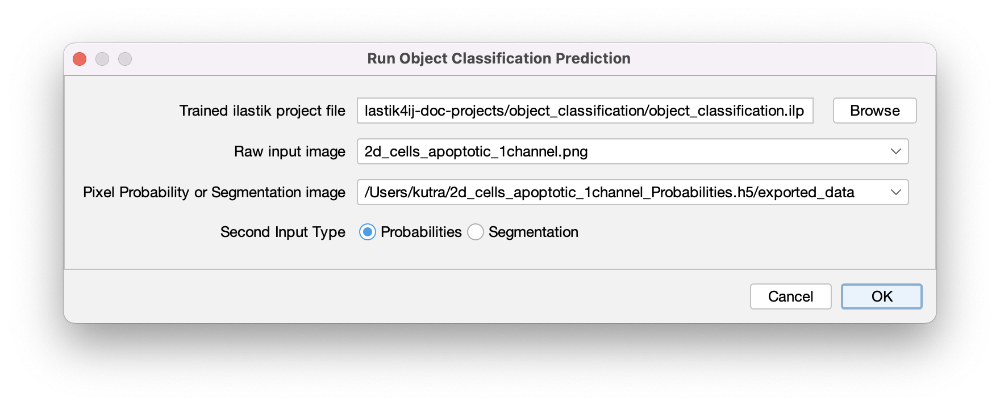
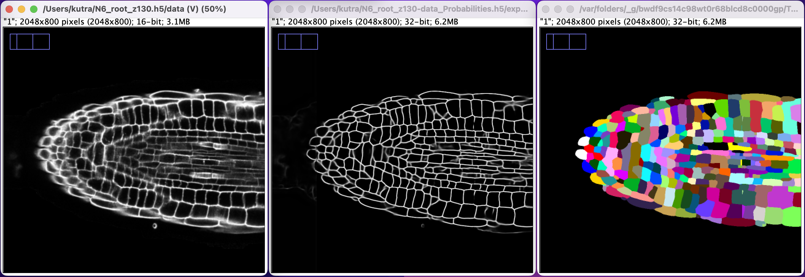
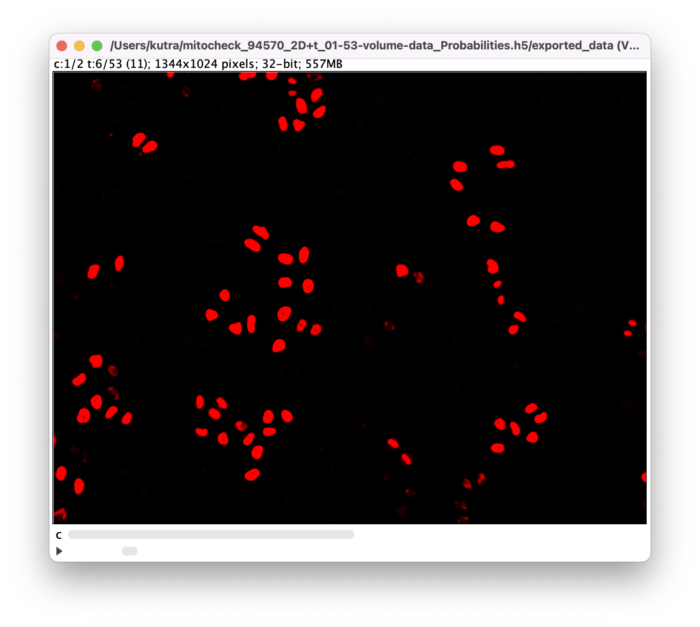

# ilastik ImageJ modules

[](https://github.com/ilastik/ilastik4ij/actions/workflows/build-main.yml)

Originally developed by Carsten Haubold, Adrian Wolny, Image Analysis and Learning Lab, HCI/IWR, University of Heidelberg._
Current development and maintenance by the _ilastik team_, Kreshuk Lab, CBB, European Molecular Biology Laboratory Heidelberg.

This repository contains ImageJ2 plugins that wrap ilastik workflows for usage in [ImageJ](https://imagej.net) 
and [KNIME](https://www.knime.com). Data transfer is managed through temporary HDF5 file export/import, which can also be performed individually.
The ilastik workflows are invoked by running the ilastik headless mode from the command line.

Currently, three workflows are wrapped: Pixel classification, Autocontext, Object classification, Boundary-based Segmentation with Multicut, and Tracking.

## Contents

* [Installation](#installation)
* [User documentation](#user-documentation)
    - [General](#general)
    - [Import](#import)
    - [Export](#export)
    - [How to train an ilastik project to be used with those wrappers](#How-to-train-an-ilastik-project-for-use-in-the-plugins)
    - [Configuration](#configuration-for-running-ilastik-from-within-Fiji)
    - [Pixel Classification and Autocontext](#pixel-classification-and-autocontext)
    - [Object Classification](#object-classification)
    - [Boundary-based Segmentation with Multicut](#boundary-based-segmentation-with-multicut)
    - [Tracking](#tracking)
    - [Usage in KNIME](#usage-in-knime)
* [Developer documentation](#developer-documentation)
    - [Deployment](#deployment)

## Installation

Within ImageJ/Fiji you can install the plugin via the `Help -> Update` menu and select the `ilastik` site.

**Note**: The plugins need Java 1.8, if you see error messages popping up that might be caused by an older Java version.

**Compatibility note:**: We try to keep the plugin backwards compatible. Some versions of ilastik are _not_ compatible with the current plugin: `1.3.3b2`,  `1.3.3rc2`, `1.3.3`, `1.3.3post1`, `1.3.3post2`, `1.4.0b27`. _We recommend to update to the latest stable version!. If you need to stick with `1.3.3x` for some reason, please use `1.3.3post3`._

## User documentation

The ilastik workflows, as well as importer and exporter, can be found in ImageJ under `Plugins -> ilastik`,
or in KNIME in the `Community Contributions -> KNIME Image Processing -> ImageJ2 -> Plugins -> ilastik`.



### General

All Plugins output status information to log files, so we suggest to keep an eye at the ImageJ `Windows -> Console`.
You can find example macros for the different plugin commands in the [`examples`](./examples) directory.

### Import

Found at `Plugins -> ilastik -> Import HDF5`.

HDF5 files can contain multiple datasets. Thus, when you import an HDF5 file containing more than one dataset, 
you will have to select which dataset you want to import by selecting the _Dataset Name_:



Here you should double check the correct meaning of the different _Dimensions_ of the dataset by specifying the _Axes_. 
At least `x` and `y` must be present, and the number of characters (`x`,`y`,`z` spatial, `c` channels and `t` time)
must be equal to the number of dimensions listed in the description above.

#### Example Macro usage

The macro below demonstrates how to import many `.h5` files that were generated with ilastik using a macro.

```javascript
input = "/absolute/path/to/some/directory/src/test/resources/2d_cells_apoptotic_1channel.h5";

datasetname = "/data";
axisorder = "tzyxc";

run("Import HDF5", "select=[" + input + "] datasetname=[" + datasetname + "] axisorder=[" + axisorder + "]");
```

see also [`./examples/import.ijm`](./examples/import.ijm)

### Export

Found at `Plugins -> ilastik -> Export HDF5`.

If you want to save the currently opened image to an HDF5 file that can be immediately opened in ilastik,
use this export option. Additionally to the location where the file should be saved, you could specify the output
data set name as well as how much the dataset should be compressed.
Use `0` for raw data because it doesn't compress well, but `9` for segmentations etc, where many pixel values are equal.
The plugin uses (lossless) gzip compression.


#### Example Macro usage

You can find a simple example macro in [`./examples/export.ijm`](./examples/export.ijm).
Furthermore, there is an example macro demonstrating how to convert a whole folder of `.tiff` files to `.h5` in [`./examples/convert_tiff_to_ilastik_h5.ijm`](./examples/convert_tiff_to_ilastik_h5.ijm).


### How to train an ilastik project for use in the plugins

In general you can use any project of the supported workflows that you trained.
However, there are some things to keep in mind:
  * The spatial dimensions (not the size along those) need to match.
    Meaning if you trained your project with 3D (`x`,`y`,`z`) data, you can only process 3D images with it.
  * The largest 3D filter you selected in ilastik, must fit inside the image.
    It's roughly the largest 3D sigma you selected times 3.5 (so with default largest sigma `10.0` it would be a minimum of `35` pixels in `z`-dimension).
  * The number of channels needs to match (also they should be in the same order), if you train e.g. on dapi + fitc, you should only process files with dapi + fitc channels.


Ideally, you train your ilastik already with `.h5` files manually generated by the [above export functionality](#export).
The export creates files with maximum compatibility with ilastik - and you will also get the best performance during training.
With this you make sure that the whole processing chain will work.


### Configuration for running ilastik from within Fiji

Found at `Plugins -> ilastik -> Configure ilastik executable location`.



* Path to ilastik executable: choose the location of your ilastik binary executable
* Number of threads to use (-1 for no limit)
* Specify an upper bound of RAM that ilastik is allowed to use

### Pixel Classification and Autocontext

[Pixel Classification](https://www.ilastik.org/documentation/pixelclassification/pixelclassification) and [Autocontext](https://www.ilastik.org/documentation/autocontext/autocontext) workflow have similar input settings.

The Pixel Classification Workflow can be found at `Plugins -> ilastik -> Run Pixel Classification Prediction`, the Autocontext Workflow at `Plugins -> ilastik -> Run Autocontext Prediction`.


**Inputs:** 

* a raw image on which to run the pixel classification (if only one is opened, there is no selection in the dialog) 
  
* a project file
* whether to produce per-pixel probabilities, or a segmentation

**Output:**

* if _Probabilities_ was selected: a multi-channel float image that you can _e.g._ threshold to obtain a 
  segmentation 
* or a _Segmentation_:a single-channel image where each pixel gets a value corresponding to the label class.
  e.g. all pixels belonging to your first label, will have the value `1`, all that belong to the 2nd class, will have the value `2` and so on.
  ilastik will assign classes based on the _highest_ probability label for each pixel.
  It is recommended to apply a LUT (e.g. `Image -> Lookup Tables -> glasbey`) to the result in order to see the _segmentation_ output. 
  .
  
#### Example macro usage

A simple example macro that opens a `.tif` file and processes it with a pre-trained ilastik pixel classification project would look like the following:

```javascript
project = "/absolute/path/to/some/directory/pixel_class_2d_cells_apoptotic.ilp";
input = "/absolute/path/to/some/directory/2d_cells_apoptotic.tif";

type = "Probabilities";

open(input);
run("Run Pixel Classification Prediction", "projectfilename=[" + project + "] input=[" + input + "] pixelclassificationtype=[" + type + "]");
```

A more complex example can be found in [`./examples/pixel_classification.ijm`](./examples/pixel_classification.ijm).


### Object Classification

Command to run pretrained [Object Classification](https://www.ilastik.org/documentation/objects/objects): `Plugins -> ilastik -> Run Object Classification Prediction`.



**Inputs:** 

* a project file
* one raw image (select the appropriate one in the dropdown box as shown above)
* one additional image that contains either per-pixel probabilities or a segmentation
* select the appropriate input type (_Probabilities_ or _Segmentation_)

**Output:**

* a new image where the pixels of each object get assigned the value that corresponds to the class that was predicted for this object (Object Predictions output from ilastik). 
  Initially this image might appear black.
  You can apply a colormap to it (e.g. `Image -> Lookup Tables -> glasbey_on_dark`) to see the result.
  


#### Example macro usage

A basic macro example for running object classification on a single image can be found in [`./examples/object_classification.ijm`](./examples/object_classification.ijm).


### Boundary-based Segmentation with Multicut

Command for [Boundary-based Segmentation with Multicut](https://www.ilastik.org/documentation/multicut/multicut): `Plugins -> ilastik -> Run Multicut`.


**Inputs:**

* a project file
* one raw image (select the appropriate one in the dropdown box as shown above)
* one additional image that contains boundary probabilities. Those can be generated, e.g. in Pixel Classification, Autocontext, or with a pre-trained Neural Network.

**Output:**

* a new integer value image (label image) where the pixels belonging to the same object have the same value.
  The example image below shows (left to right) raw data, boundary probability map, and multicut segmentation result (with applied LUT).
  

#### Example macro usage

A basic macro example for running Multicut on a single image can be found in [`./examples/multicut.ijm`](./examples/multicut.ijm).

### Tracking
Found at `Plugins -> ilastik -> Run Tracking`.


**Inputs:** 

* a project file
* one raw image (with a time axis!) 
* one additional image that contains either per-pixel probabilities or a segmentation with the same dimensions as the raw image. 
  
* select the appropriate input type (_Probabilities_ or _Segmentation_)

**Output:**

* a new image stack where the pixels of each object in each frame get assigned the value that
  corresponds to the _lineage ID_ of the tracked object. Whenever an object enters the field of view
  it will be assigned a new _lineage ID_. All descendants of this object will be assigned the same
  _lineage ID_. 

#### Example macro usage

A basic macro example for running Tracking on a single image can be found in [`./examples/tracking.ijm`](./examples/tracking.ijm).

### Usage in KNIME


## Developer documentation

The workflow wrappers are ImageJ2 plugins (see https://imagej.net/Writing_plugins), annotated with
`@Plugin` for automated discovery by the _scijava_ plugin architecture, and derived from `Command`
to be an executable item. Each command can have multiple `@Parameter`s, which are to be provided by
the user in an auto-generated GUI (see https://imagej.net/Script_Parameters for a list of which
parameters are allowed). One can have multiple `Dataset`s as input parameters, but the output should
be an `ImgPlus` (an ImageJ2 datastructure wrapping an [ImgLib2](https://imagej.net/ImgLib2) `Img`
with metadata) so that the result pops up as new window. A `Dataset` is a wrapper around an
`ImgPlus`.

**Attention:** there are ImageJ 1 and ImageJ 2 containers for images. In ImageJ 1, images were stored
as `ImagePlus`, containing `ImageProcessors` to access the underlying data. We try to use ImageJ 2
containers everywhere which are roughly wrapped as `Dataset > ImgPlus > Img >
RandomAccessibleInterval`.

### Examples

If you want to run workflows from your own Java code, have a look at
`src/test/java/org/ilastik/ilastik4ij/Demo.java`.
Example macros can be found in the `examples` directory.

### Manually test in a local Fiji installation

Run `scripts/fiji-deploy.py` to build project and copy the newly built plugin to Fiji.

### Deployment

We follow the setup of other `scijava` modules and use their Travis setup that allows us to
automatically deploy Maven artifacts (built modules) as explained [here](https://imagej.net/Travis).
The project configuration, including dependencies, is contained in the `pom.xml` file. To create a
new release, use the `release-version.sh` script from https://github.com/scijava/scijava-scripts,
which goes a long way of ensuring that the project is ready to be published. Once it is released,
the nightly build of KNIME Image Processing (KNIP) will pick it up and wrap it as well.

[fiji]: https://fiji.sc/
